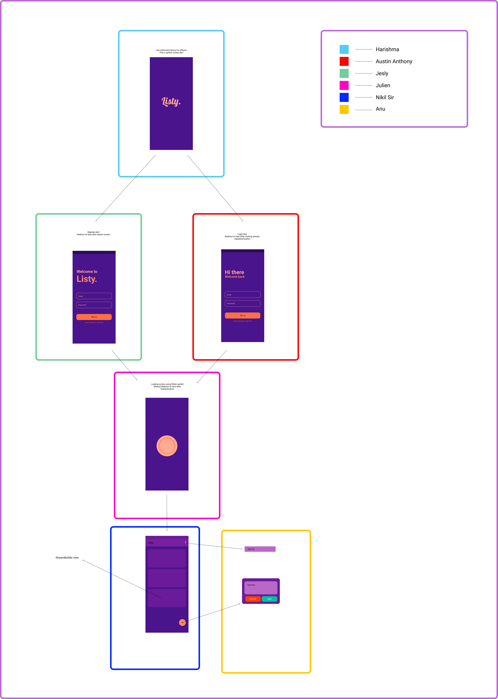
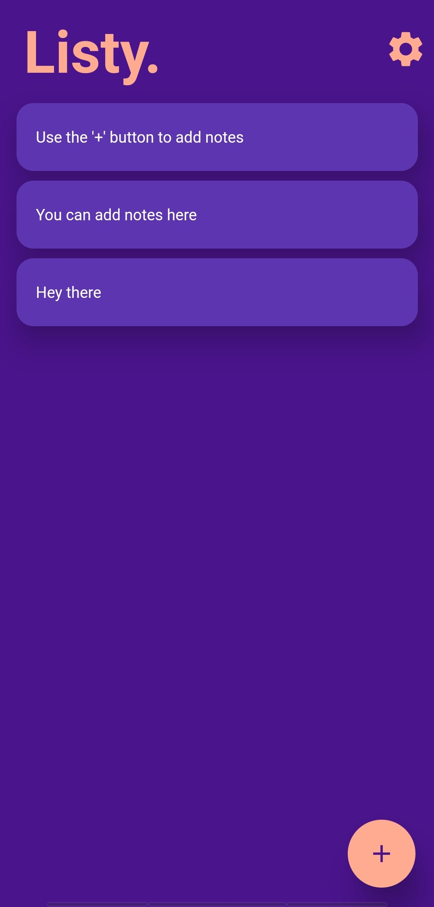
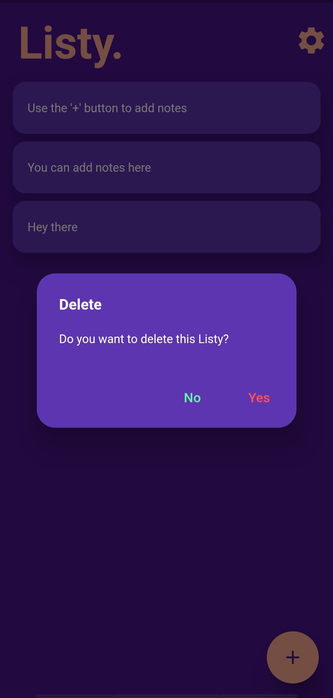
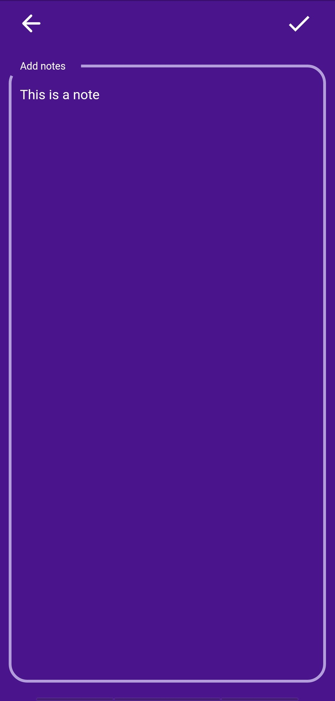
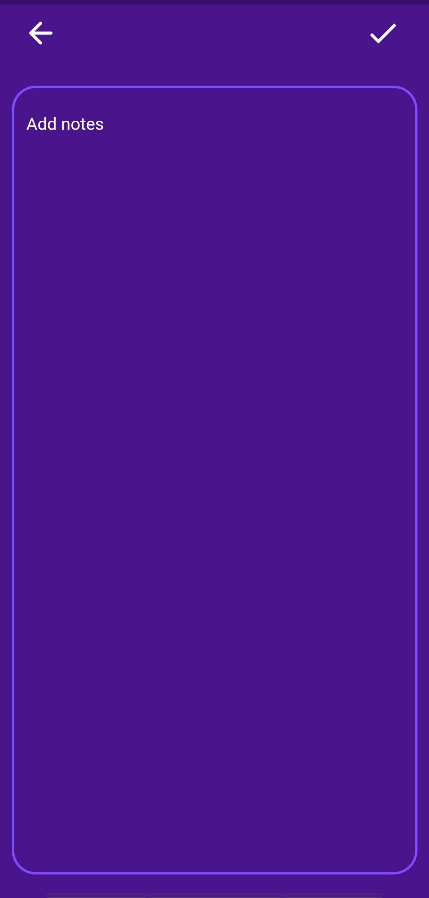
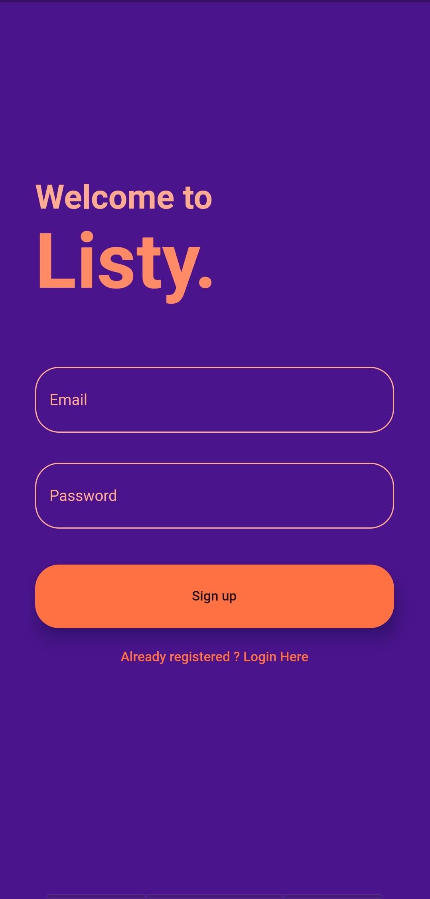
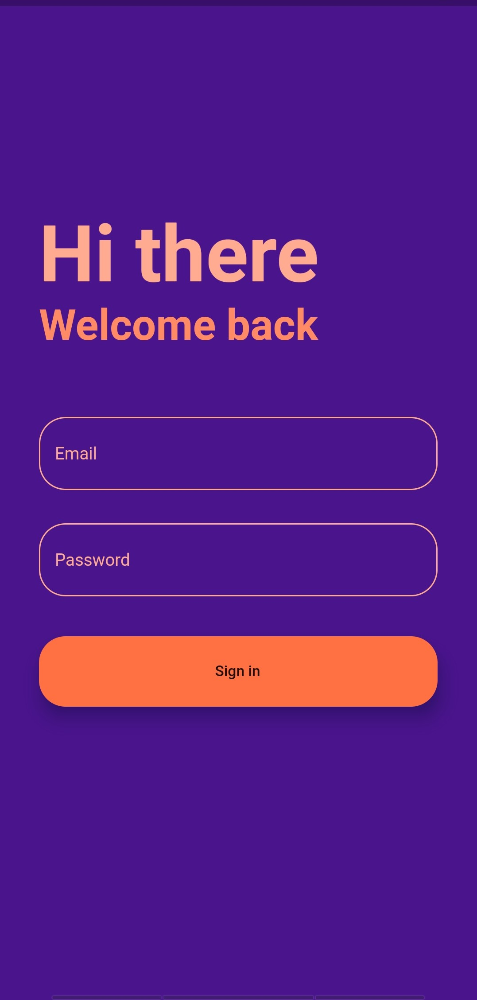

# Listy

A feature packed notes taking application.

## Getting Started

Flutter installation guide: https://flutter.dev/docs/get-started/install
Flutter installation video: https://www.youtube.com/watch?v=T9LdScRVhv8&feature=emb_logo
(best to follow the guide)

Git installation: https://git-scm.com/

Best source to learn flutter:https://dev.to/devdammak/top-10-youtube-channels-for-flutter-developers-2020-5ea8#:~:text=Top%2010%20Youtube%20channels%20for%20Flutter%20developers%20%282020%29,Code%20With%20Andrea.%205%20Marcus%20Ng.%20More%20items
(I suggest netNinja and MtechViral)

## Installation

Fork this project.After completion sent me a pull request.

## Project Structure

## Screenshots

  
  
  
  
  
  
  

Project completed on february 14th 2021

Apk file is in the project.
Hosted link: https://listy-project.firebaseapp.com/#/
